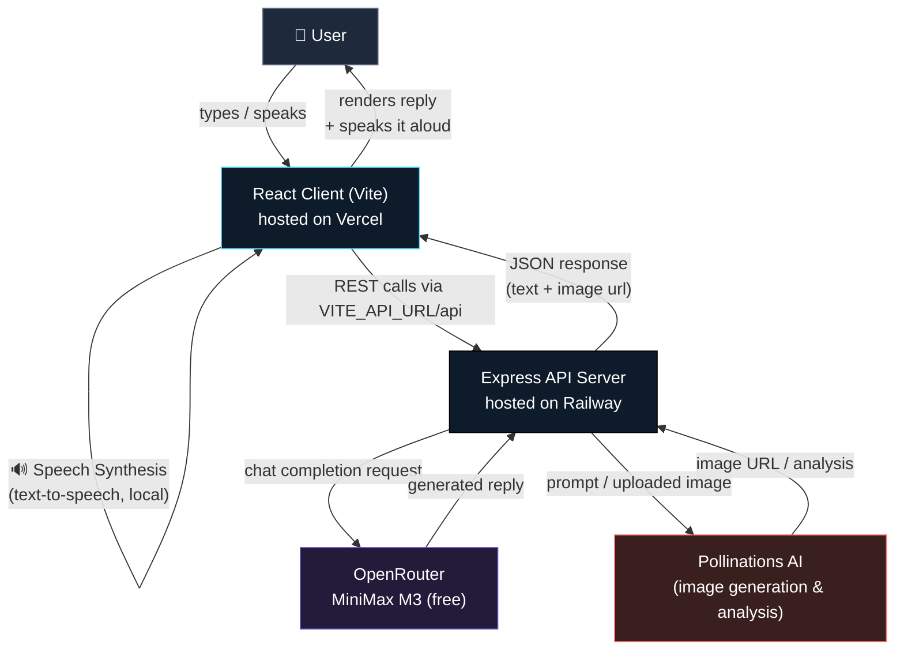

<div align="center">

# 💬 AI Chatbot

### A Multi-Modal Chat Experience — Text, Voice & Vision in One App

[](https://react.dev/)
[](https://www.typescriptlang.org/)
[](https://expressjs.com/)
[](https://vitejs.dev/)
[](https://nodejs.org/)
[](https://vercel.com/)
[](https://railway.app/)
[](https://openrouter.ai/)

[🚀 Live Demo](https://chatbot-ai-ten-sooty.vercel.app) • [Features](#-features) • [Architecture](#-architecture) • [Setup](#-setup) • [Deployment](#-deployment)

</div>

---

## 📖 About

**AI Chatbot** is a full-stack conversational app that fuses three modalities into one interface:

| | |
|---|---|
| 🧠 **Text** | Conversational responses from **MiniMax M3 (free)**, served via [OpenRouter](https://openrouter.ai/) |
| 🎙️ **Voice** | Hands-free input via the browser's native Speech Recognition API, with spoken replies |
| 🖼️ **Vision** | Upload a photo for analysis, or generate new images from a prompt via **Pollinations AI** |

The frontend is a **React + TypeScript** (Vite) client. The backend is an **Express + TypeScript** API that proxies all model calls, so API keys never reach the browser.

**🔗 Live app:** [https://chatbot-ai-ten-sooty.vercel.app](https://chatbot-ai-ten-sooty.vercel.app)

---

## 🛠️ Tech Stack

<div align="center">

| Layer | Technology |
|---|---|
| **Frontend** |    |
| **Backend** |    |
| **Text Model** |  |
| **Voice** |  |
| **Image Generation** |  |
| **Hosting** |   |

</div>

---

## 🏗️ Architecture



**Flow summary:**
1. The **client** captures text or speech input (speech-to-text happens entirely in the browser).
2. Requests go to the **Express server**, which holds all API credentials.
3. Text prompts route to **OpenRouter → MiniMax M3**; image prompts/uploads route to **Pollinations AI**.
4. The server returns a unified JSON response; the client renders it and optionally speaks the reply back using the browser's speech synthesis.

---

## ✨ Features

- **🧠 Free LLM-powered chat** — MiniMax M3 via OpenRouter, no paid API required to start
- **🎙️ Hands-free voice mode** — native browser speech recognition, no external TTS service
- **🖼️ Image understanding** — upload a photo and ask questions about it
- **🎨 Image generation** — auto-selects a compatible model, aspect ratio, and prompt treatment per request
- **🔁 Configurable image fallbacks** — set a preferred model or a fallback catalog via env vars
- **🔐 Server-side key handling** — credentials never touch the client
- **☁️ Split deployment** — client on Vercel, API on Railway, connected via CORS-safe env vars

---

## 🗂️ Project Structure

```
ai-chatbot/
├── client/              # React + TypeScript frontend (Vite)
├── server/              # Express + TypeScript backend API
├── .gitignore
├── package.json         # Root scripts (dev, install:all)
└── package-lock.json
```

---

## ⚙️ Setup

### 1. Get an OpenRouter API key

Create a free key at [openrouter.ai/keys](https://openrouter.ai/keys).

### 2. Configure environment variables

Copy `.env.example` to `.env` in `server/` and set:

```env
OPENROUTER_API_KEY=sk-or-v1-...
CHAT_MODEL=minimax/minimax-m3:free
```

Image generation runs on Pollinations AI and auto-selects a compatible model, aspect ratio, and prompt treatment. Optional tuning:

```env
# Preferred fallback image model (legacy fallback is `flux`)
IMAGE_MODEL=flux

# Comma-separated fallback catalog override
IMAGE_MODELS=flux,turbo,another-model
```

### 3. Install and run

```bash
npm install
npm run install:all
npm run dev
```

| Service | URL |
|---|---|
| Frontend | http://localhost:5173 |
| API | http://localhost:3001 |

---

## 🚀 Deployment

The app deploys as two independent services.

### Backend → Railway

Deploy the `server` folder and set:

```env
OPENROUTER_API_KEY=sk-or-v1-...
CLIENT_URL=https://your-vercel-app.vercel.app
```

Current live config:

```env
CLIENT_URL=https://chatbot-ai-ten-sooty.vercel.app
```

> 💡 For multiple frontend domains, use a comma-separated `CORS_ORIGINS` value instead of `CLIENT_URL`.

### Frontend → Vercel

Deploy the `client` folder with:

```env
VITE_API_URL=https://your-railway-service.up.railway.app
```

**Important:**
- Don't append `/api` — the client adds it automatically
- Vite bakes `VITE_*` vars in at build time — **redeploy Vercel** after any change
- Verify the API is healthy first: `https://your-railway-service.up.railway.app/api/health`

---

## 🌐 Live Deployment

| Layer | URL |
|---|---|
| Frontend (Vercel) | [https://chatbot-ai-ten-sooty.vercel.app](https://chatbot-ai-ten-sooty.vercel.app) |

---

## 📄 License

Check the repository for license details, or add one if you're maintaining a fork.

---

<div align="center">

**Text, voice, and vision — one chatbot.**

</div>